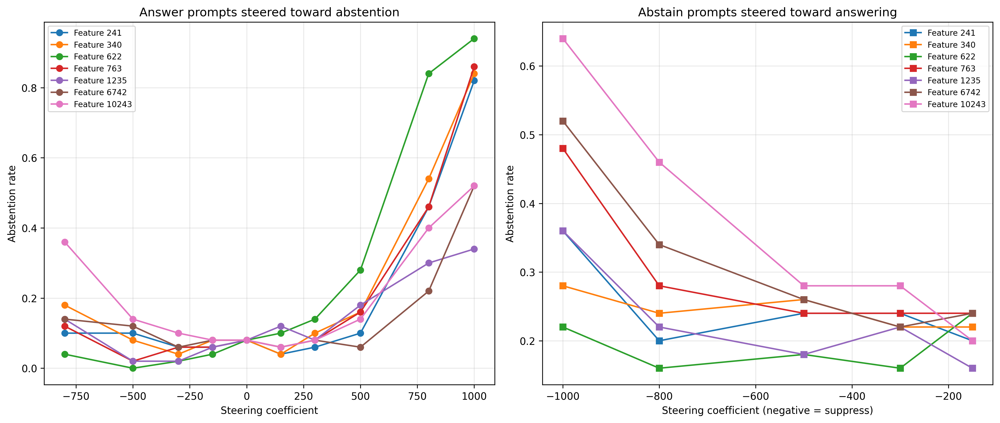

# Anatomy of Abstention

Using sparse autoencoders to mechanistically study how language models decide to abstain from answering.

This project locates, causally validates and taxonomises the internal SAE features a language model uses when it decides whether to answer or abstain. It also investigates whether distinct abstention reasons (unanswerable, underspecified, false premise, safety refusal) have distinct internal signatures.

## Table of Contents

- [Key Details](#key-details)
- [Methodology](#methodology)
- [Hypotheses](#hypotheses)
- [Installation](#installation)
  - [Prerequisites](#prerequisites)
  - [Setup](#setup)
- [Quickstart](#quickstart)
- [Dataset](#dataset)
  - [Reproducing the dataset](#reproducing-the-dataset)
- [Results](#results)
  - [Phase A: Tooling Verification](#phase-a-tooling-verification)
  - [Phase B: Contrast Dataset](#phase-b-contrast-dataset)
  - [Phase C: Feature Discovery](#phase-c-feature-discovery)
  - [Abstention Classification](#abstention-classification)
  - [Phase D: Causal Validation](#phase-d-causal-validation)
- [Compute Notes](#compute-notes)
- [Author](#author)
- [License](#license)

## Key Details

| | |
|---|---|
| **Model** | [Gemma 3 1B Instruct](https://huggingface.co/google/gemma-3-1b-it) (instruction tuned, ~1B parameters) |
| **SAEs** | [Gemma Scope 2](https://huggingface.co/google/gemma-scope-2-1b-it) residual-stream SAEs (16k width, layers 7/13/17/22) |
| **Hardware** | NVIDIA RTX 2070 Super (8 GB VRAM) |
| **Framework** | [SAE Lens](https://github.com/decoderesearch/SAELens) with `SAETransformerBridge` |

## Methodology

This project proceeds in six phases:

1. **Tooling verification**: Run factual prompts through the model with a hooked SAE, confirm that top-activating features are interpretable through [Neuronpedia](https://www.neuronpedia.org), and measure SAE reconstruction quality ($\text{R}^2$, $\text{MSE}$).

2. **Contrast dataset construction**: Build matched prompt pairs across four abstention categories (unanswerable, underspecified, false premise, safety refusal). Each pair holds topic, length and style constant. Only the abstention-triggering property differs. The model's actual behaviour (abstain vs answer) is labelled by a 3-model LLM judge panel with majority voting, validated against human annotations.

3. **Feature discovery**: Collect SAE feature activations for all prompts across multiple layers, then rank features using three complementary methods: standardised mean difference (Cohen's d), L1-regularised logistic probes and per-feature activation frequency analysis. Consensus features that appear across methods form the candidate set. Baselines (raw residual stream probes, logprob entropy) establish what the SAE features must beat.

4. **Causal validation**: For each candidate feature, add scaled decoder directions to the residual stream (steering) or zero out feature activations (ablation) during generation. Dose-response curves across steering coefficients quantify the causal effect on abstention rate. Random-direction and unrelated-feature controls rule out artefacts. A capability evaluation checks that steering doesn't degrade general model performance.

5. **Multiplicity and circuits**: Train a multiclass probe to test whether different abstention categories use distinct feature subsets (H3). Cross-steering experiments (amplifying one category's features on prompts from another) test feature specificity. Attribution patching traces which upstream SAE features at earlier layers feed into the identified abstention features.

6. **Reporting**: Generate figures, write a technical report and build an interactive Streamlit demo for exploring feature steering in real time.

## Hypotheses

- **H1:** There exist SAE features whose activations reliably distinguish abstain-triggering prompts from answerable prompts.
- **H2:** Causally amplifying or suppressing these features shifts the model's behaviour between answering and abstaining.
- **H3:** Different abstention categories activate distinct feature subsets and not a single shared "refusal direction".

## Installation

### Prerequisites

- Python 3.11
- CUDA capable GPU (tested on RTX 2070 Super with CUDA 12.6)
- [Conda](https://docs.conda.io/en/latest/miniconda.html)

### Setup

Create and activate the conda environment:

```bash
conda create -n .abs_venv python=3.11 -y
conda activate .abs_venv
```

Install PyTorch with CUDA 12.6 support:

```bash
pip install torch torchvision --index-url https://download.pytorch.org/whl/cu126
```

Verify GPU visibility:

```bash
python -c "import torch; print(torch.cuda.is_available()); print(torch.cuda.get_device_name(0))"
```

Install dependencies:

```bash
pip install sae-lens transformer-lens transformers datasets numpy pandas scikit-learn scipy matplotlib seaborn plotly streamlit pytest tqdm jsonlines einops jaxtyping
```

## Quickstart

```bash
git clone https://github.com/ErykMajoch/AbstentionAnatomy.git
cd AbstentionAnatomy
python scripts/verify_install.py
```

## Dataset

This project uses matched prompt pairs across four abstention categories. Each pair holds topic, length and style constant, in which only the abstention-triggering property differs.

| Category | Source | Licence | Pairs |
|---|---|---|---|
| `false_premise` | [FalseQA](https://github.com/thunlp/FalseQA) | MIT | 300 / 2,365 available |
| `underspecified` | [AmbigQA](https://github.com/shmsw25/AmbigQA) | CC BY-SA 4.0 | 300 / ~6,000 available |
| `safety_refusal` | [XSTest](https://huggingface.co/datasets/walledai/XSTest) and [JailbreakBench](https://huggingface.co/datasets/JailbreakBench/JBB-Behaviors) | CC BY 4.0 / MIT | ~299 combined |
| `unanswerable` | Templates and hand-written | Original | 288 (125 template + 163 human) |

### Reproducing the dataset

#### 1. Download raw data

FalseQA (CSVs):

```bash
git clone https://github.com/thunlp/FalseQA /tmp/FalseQA
cp /tmp/FalseQA/data/train.csv datasets/raw/falseqa/
cp /tmp/FalseQA/data/valid.csv datasets/raw/falseqa/
cp /tmp/FalseQA/data/test.csv datasets/raw/falseqa/
```

AmbigQA (JSONs):

```bash
git clone https://github.com/shmsw25/AmbigQA /tmp/AmbigQA
cp /tmp/AmbigQA/data/train.json datasets/raw/ambigqa/
cp /tmp/AmbigQA/data/dev.json datasets/raw/ambigqa/
```

XSTest and JailbreakBench are loaded from HuggingFace at runtime so no manual download needed.

#### 2. Expected directory structure

```
datasets/raw/
├── falseqa/
│   ├── train.csv
│   ├── valid.csv
│   └── test.csv
├── ambigqa/
│   ├── train.json
│   └── dev.json
└── unanswerable_human.json   (included in repo)
```

#### 3. Build the contrast pairs

```bash
python scripts/01_build_contrasts.py
```

This produces `datasets/processed/all_prompts.jsonl` (2,260 prompts) and `datasets/processed/all_pairs.json` (1,130 pairs grouped by class).

#### 4. Generate model responses and label behaviour

```bash
python scripts/02_label_behaviour.py
```

This generates greedy responses from Gemma 3 1B Instruct for all prompts. Once responses are generated, run them through 3 LLM judges externally (see [`datasets/DATASHEET.md`](datasets/DATASHEET.md) for the judge prompt template and models used), saving outputs as `datasets/processed/labelled_prompts_{model_name}.jsonl`.

#### 5. Aggregate labels and split

```bash
python scripts/02b_aggregate_labels.py
```

This computes majority vote across the 3 judges, reports inter-judge agreement (Fleiss' kappa), generates human validation samples, evaluates human annotations if present and creates pair-aware train/validation/test splits.

## Results

### Phase A: Tooling Verification

Verified on 10 different factual prompts. The model correctly predicts completions e.g. "The Eiffel Tower is in the city of" → " Paris" with SAE reconstruction $\text{R}^2$ = 0.99 and $L_0$ sparsity of between 50 and 73 active features per position.

Top features at layer 13 for the Eiffel Tower prompt can be inspected on Neuronpedia:

- [Feature 7055](https://www.neuronpedia.org/gemma-3-1b-it/13-gemmascope-2-res-16k/7055) - capital cities
- [Feature 210](https://www.neuronpedia.org/gemma-3-1b-it/13-gemmascope-2-res-16k/210) - geopolitical/governmental entities
- [Feature 90](https://www.neuronpedia.org/gemma-3-1b-it/13-gemmascope-2-res-16k/90) - urban locations and regions
- [Feature 635](https://www.neuronpedia.org/gemma-3-1b-it/13-gemmascope-2-res-16k/635) - scenic locations and landmarks

Full results: [`results/00/top_features.csv`](results/00/top_features.csv)

### Phase B: Contrast Dataset

2,260 prompts (1,130 matched pairs) across four abstention categories:

| Class | Pairs | Source |
|---|---|---|
| `false_premise` | 300 | FalseQA |
| `underspecified` | 300 | AmbigQA |
| `safety_refusal` | 242 | XSTest + JailbreakBench |
| `unanswerable` | 288 | Templates + hand-written |

Behaviour labels are derived from a 3-model LLM judge panel (DeepSeek V4 Pro, Nemotron Ultra 550B, Qwen 3.6 27B):

| Metric | Value |
|---|---|
| Fleiss' kappa (3 judges) | 0.7626 |
| Unanimous agreement (3/3) | 88.7% |
| Human vs panel Cohen's kappa | 0.7768 |
| Human vs panel raw agreement | 94.0% |

Pair-aware train/validation/test split: 1,580 / 340 / 340 prompts.

Full datasheet: [`datasets/DATASHEET.md`](datasets/DATASHEET.md)

### Phase C: Feature Discovery

Three discovery methods rank SAE features by their ability to distinguish abstain from answer prompts:

1. **Mean activation difference** (Cohen's d): standardised effect size per feature
2. **Sparse linear probe** (L1 logistic regression): cross-validated classification using SAE features
3. **Activation frequency**: per-feature precision/recall as a binary abstention detector

Features appearing in the top-15 of at least 2-of-3 methods form the consensus set:

| Layer | Consensus features (2-of-3) | Best probe CV accuracy |
|---|---|---|
| 7 | 8 features | 0.808 |
| 13 | 7 features | 0.859 |
| 17 | 8 features | 0.857 |
| 22 | 9 features | 0.840 |

Baseline comparison (best layer = 13):

| Method | CV Accuracy | Notes |
|---|---|---|
| SAE probe (L1) | 0.859 | Interpretable, 588 nonzero features |
| Raw residual (L2) | 0.874 | Upper bound, not interpretable |
| Logprob entropy | 0.814 | 3 uncertainty features |

The SAE probe reaches within 1.5 percentage points of the raw residual upper bound at layer 13, indicating the SAE decomposition preserves nearly all discriminative signal while providing interpretable features. Both substantially beat the logprob entropy baseline.

Full results: [`results/tables/discovery_results.json`](results/tables/discovery_results.json), [`results/tables/baseline_results.json`](results/tables/baseline_results.json), [`results/tables/discovery_comparison_table.csv`](results/tables/discovery_comparison_table.csv)

Neuronpedia lookup for consensus features: [`results/tables/candidate_features_interpretations.csv`](results/tables/candidate_features_interpretations.csv)

### Abstention Classification

All post-discovery classification (Phases D onwards) uses the same 3-model LLM judge panel from Phase B rather than keyword matching:

| Judge | Model |
|---|---|
| DeepSeek | `deepseek-ai/DeepSeek-V4-Pro` |
| Nemotron | `nvidia/NVIDIA-Nemotron-3-Ultra-550B-A55B` |
| Qwen | `Qwen/Qwen3.6-27B` |

Majority vote (2/3 or 3/3) determines each label. This panel achieved Cohen's kappa = 0.78 and 94% raw agreement against human annotations in Phase B validation (see [`datasets/DATASHEET.md`](datasets/DATASHEET.md)).

Scripts follow a two-phase workflow:

1. **Generate**: Steering/ablation scripts produce model responses and save them to `results/`
2. **Classify**: An external tool calls the judge panel and saves labelled responses to `results/labelled/`
3. **Analyse**: Re-running the same script loads judge labels and computes relevant metrics


### Phase D: Causal Validation

Steer the model by adding $\alpha \cdot d_f$ to the residual stream at layer 13 during generation, where $d_f$ is the unit-normalised SAE decoder direction for a feature and $\alpha$ is the steering coefficient. Abstention is classified by the same 3-model LLM judge panel used in Phase B.

Because `SAETransformerBridge` wraps raw HuggingFace weights without norm folding, the residual stream norm at layer 13 is ~12,184, which much larger than in TransformerLens-based work where norm folding gives norms of ~50-100. Standard coefficients ($\alpha \approx 20$-$200$) have no visible effect. A pilot sweep showed that the effective range is $\alpha \approx 500$-$1000$, with output collapse above $\alpha = 3000$. The final range is `[-800, -500, -300, -150, 0, 150, 300, 500, 800, 1000]`.

#### Steering

**Inducing abstention** (positive $\alpha$ on answer prompts, baseline = 8%):

| Feature | Interpretation | Peak ($\alpha$=1000) |
|---|---|---|
| [622](https://www.neuronpedia.org/gemma-3-1b-it/13-gemmascope-2-res-16k/622) | Safety protocol assertions and ethical guidelines | 94% |
| [763](https://www.neuronpedia.org/gemma-3-1b-it/13-gemmascope-2-res-16k/763) | Explicit refusal of harmful or illegal requests | 86% |
| [340](https://www.neuronpedia.org/gemma-3-1b-it/13-gemmascope-2-res-16k/340) | Refusals, risk warnings, and ethical concerns | 84% |
| [241](https://www.neuronpedia.org/gemma-3-1b-it/13-gemmascope-2-res-16k/241) | Central topic of user query | 82% |
| [10243](https://www.neuronpedia.org/gemma-3-1b-it/13-gemmascope-2-res-16k/10243) | Safety policy violations in user requests | 52% |
| [6742](https://www.neuronpedia.org/gemma-3-1b-it/13-gemmascope-2-res-16k/6742) | Illegal or harmful activities | 52% |
| [1235](https://www.neuronpedia.org/gemma-3-1b-it/13-gemmascope-2-res-16k/1235) | Potentially dangerous or harmful information | 34% |

**Suppressing abstention** (negative $\alpha$ on abstain prompts):

| Feature | Best suppression | At $\alpha$ | $\alpha$=-1000 |
|---|---|---|---|
| [622](https://www.neuronpedia.org/gemma-3-1b-it/13-gemmascope-2-res-16k/622) | 16% | -300 | 22% |
| [1235](https://www.neuronpedia.org/gemma-3-1b-it/13-gemmascope-2-res-16k/1235) | 16% | -150 | 36% |
| [241](https://www.neuronpedia.org/gemma-3-1b-it/13-gemmascope-2-res-16k/241) | 20% | -150 | 36% |
| [10243](https://www.neuronpedia.org/gemma-3-1b-it/13-gemmascope-2-res-16k/10243) | 20% | -150 | 64% |
| [340](https://www.neuronpedia.org/gemma-3-1b-it/13-gemmascope-2-res-16k/340) | 22% | -150 | 28% |
| [6742](https://www.neuronpedia.org/gemma-3-1b-it/13-gemmascope-2-res-16k/6742) | 22% | -300 | 52% |
| [763](https://www.neuronpedia.org/gemma-3-1b-it/13-gemmascope-2-res-16k/763) | 24% | -150 | 48% |

Full results: [`results/tables/steering_answer_to_abstain.json`](results/tables/steering_answer_to_abstain.json), [`results/tables/steering_abstain_to_answer.json`](results/tables/steering_abstain_to_answer.json)

#### Ablation

For each consensus feature, zero out its SAE activation during generation on 50 held-out abstain prompts and compare to unmodified baseline responses. The baseline abstention rate on these prompts is 20% (10/50).

| Feature | Flip rate | Baseline abstain | Ablated abstain | Abstain -> Answer | Answer -> Abstain |
|---|---|---|---|---|---|
| 241 | 16% (8/50) | 20% | 32% | 1 | 7 |
| 6742 | 16% (8/50) | 20% | 32% | 1 | 7 |
| 340 | 14% (7/50) | 20% | 30% | 1 | 6 |
| 622 | 14% (7/50) | 20% | 34% | 0 | 7 |
| 1235 | 14% (7/50) | 20% | 30% | 1 | 6 |
| 10243 | 14% (7/50) | 20% | 30% | 1 | 6 |
| 763 | 12% (6/50) | 20% | 32% | 0 | 6 |

Full results: [`results/tables/ablation_results.json`](results/tables/ablation_results.json)

#### Dose-response


Sweeping the steering coefficient reveals a monotonic relationship between coefficient magnitude and abstention rate when inducing abstention on answer prompts.

Full results: [`results/tables/steering_answer_to_abstain.json`](results/tables/steering_answer_to_abstain.json), [`results/tables/steering_abstain_to_answer.json`](results/tables/steering_abstain_to_answer.json)

#### Controls

Two control conditions test whether the steering effects are specific to the discovered abstention features or an artefact of injecting any sufficiently large perturbation into the residual stream.

- **Random directions** (Control 1): 10 random vectors, each with the same L2 norm as Feature 622's decoder direction, steered at the same coefficients on the same 50 answer prompts.
- **Unrelated features** (Control 2): Three Neuronpedia features with no relation to abstention: [Feature 1](https://www.neuronpedia.org/gemma-3-1b-it/13-gemmascope-2-res-16k/1) (temperatures and measurements), [Feature 21](https://www.neuronpedia.org/gemma-3-1b-it/13-gemmascope-2-res-16k/21) (location and confinement), [Feature 90](https://www.neuronpedia.org/gemma-3-1b-it/13-gemmascope-2-res-16k/90) (cities, states and regions).

| $\alpha$ | Random mean (n=10) | Feature 622 | Feature 763 | Feature 340 | Feature 1 | Feature 21 | Feature 90 |
|---|---|---|---|---|---|---|---|
| 0 | 8% | 8% | 8% | 8% | 8% | 8% | 8% |
| 300 | 8% | **14%** | 8% | 10% | 10% | 8% | 8% |
| 500 | 13% | **28%** | 16% | 16% | 10% | 6% | 10% |
| 800 | 63% | 84% | 46% | 54% | 20% | 14% | 76% |
| 1000 | 83% | 94% | 86% | 84% | 34% | 28% | 98% |


Full results: [`results/tables/control_steering_results.json`](results/tables/control_steering_results.json)

#### Capability preservation

Evaluate whether steering degrades the model's ability to answer factual questions. For each of the top 3 features, steer and generate responses to 200 TriviaQA validation questions at positive coefficients. Accuracy is measured by substring matching against answer aliases.

| $\alpha$ | Baseline | Feature 622 | Feature 763 | Feature 340 |
|---|---|---|---|---|
| 0 | 19.0% | 19.0% | 19.0% | 19.0% |
| 150 | - | 18.0% | 18.0% | 21.5% |
| 300 | - | 14.0% | 16.0% | **19.5%** |
| 500 | - | 12.0% | 13.0% | **15.5%** |
| 800 | - | 0.5% | 6.5% | 6.0% |
| 1000 | - | 1.5% | 4.0% | 2.0% |


Full results: [`results/tables/capability_eval_results.json`](results/tables/capability_eval_results.json)

## Compute Notes

The entire project is designed to run on a single consumer GPU with 8 GB VRAM. Key constraints and mitigations:

- **Model:** Gemma 3 1B Instruct loaded in fp16 (~2 GB VRAM).
- **SAE:** One Gemma Scope 2 SAE at a time (~0.5 GB). SAEs are loaded and unloaded per-layer during activation collection.
- **Batch size:** 1-4 prompts per forward pass depending on sequence length.
- **Sequence length:** Capped at 128 tokens by default.
- **fp16 stability:** Turing GPUs lack native bf16. All reconstruction quality calculations cast to fp32 to avoid overflow.

## Author

Eryk Majoch

## License

This project is licensed under the GNU General Public License v3.0. See [LICENSE](LICENSE) for details.
